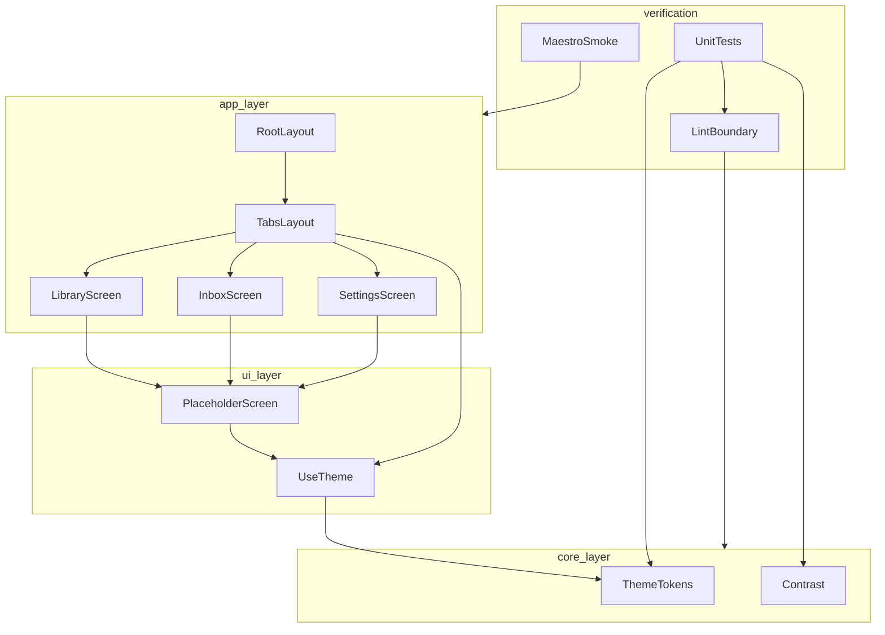
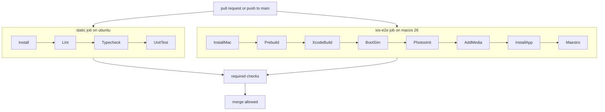

# Technical Design: app-foundation

## Overview

**Purpose**: 本スペックは、FormCatalog（写真ライブラリの筋トレ参考動画を種目別に整理する iOS アプリ）の骨格と、**エージェントが自分の書いたコードを自分で検証できる配管**を同時に立ち上げる。以降のすべての機能スペックは、ここで定めたディレクトリ構造・依存方向・品質コマンド・CI の上に乗る。

**Users**: 開発者本人（Windows のみ、Mac なし）と、以降の機能スペックを実装する Codex / レビューする Claude。前者にとっては手元で動く開発ループが、後者にとっては「通ったと嘘を書けない」機械的な判定基準が価値である。

**Impact**: リポジトリはアプリケーションコードを 1 行も持たない状態から、Expo Go で起動する空のアプリと、Lint / 型検査 / ユニットテスト / iOS Simulator ビルド / E2E がすべて緑になる CI へ移行する。機能画面の中身は含まない。中身が空のうちに配管を通しきることが本スペックの目的である。

### Goals

- Windows 単独で開発ループ（起動・Lint・型検査・ユニットテスト）が回る
- Apple Developer Program の登録なしに、実機（Expo Go）と CI（署名なし Simulator ビルド）の両方で動作を確認できる
- `/AGENTS.md` §0 の「ロジックを React に依存させない」制約を、ディレクトリ構造と Lint ルールで**機械的に**強制する
- 以降のスペックが、画面ファイルを追加するだけで導線を得られる 3 タブ骨格を提供する
- CI の全ジョブを必須ゲートにし、未検証のコードがマージされない状態を作る

### Non-Goals

- 各タブの中身（`library-browser` / `tagging-workflow` / `video-viewer` が所有）
- 永続化層、種目シード（`local-data-store` が所有）
- EAS の設定・認証・実機配信（`eas-delivery` が所有）
- 写真ライブラリの権限定義と usage description（`media-library-sync` が所有）
- 横向き表示の解除（`video-viewer` が個別画面で行う）
- React コンポーネントの描画ユニットテスト（Maestro と実機目視が担う）

## Boundary Commitments

### This Spec Owns

- `package.json` の**スクリプト名 4 つ**（`start` / `lint` / `typecheck` / `test`）と、土台となる依存のバージョン固定
  - 以降のスペックが自分の機能に必要な依存を `package.json` に追加することは境界侵犯ではない。本スペックが所有するのは**スクリプト名と既存依存のバージョン**であり、これらの変更だけが Revalidation Trigger に当たる
- `src/` 配下の三層構造（`core` / `ui` / `app`）と**層間の依存方向**
- `eslint.config.js` の層境界ルールと、そのルールが有効であることを検証するテスト
- `tsconfig.json`（strict 設定と `@/` 別名）と `vitest.config.ts`
- `app.json` のアプリ識別情報（bundle identifier、表示名、向き、外観追従、iOS 最低バージョン）
- `src/app/_layout.tsx` と `src/app/(tabs)/_layout.tsx`（ルート構成と 3 タブの定義）
- `src/core/theme/`（デザイントークンとコントラスト計算）および `src/ui/theme/useTheme.ts`
- `.github/workflows/ci.yml` のジョブ構成、キャッシュ、必須ゲート
- `.maestro/smoke.yaml` と CI 用シードメディア
- `.gitignore` と README の開発手順

### Out of Boundary

- `eas.json` およびすべての EAS 設定。本スペックは EAS に一切触れない
- SQLite のスキーマ、マイグレーション、リポジトリ API
- 写真ライブラリ・カメラ・通知などの権限文言と権限フロー
- 各タブ配下の画面ファイル（`(tabs)/index.tsx` などの**プレースホルダ本体は所有するが**、そこに機能を実装することはしない）
- `ios/` `android/` のネイティブプロジェクト（コミットせず、CI が prebuild で生成する）
- App Store 公開に関わる一切

### Allowed Dependencies

- Expo SDK 57 系の公式パッケージ（`expo`、`expo-router`、`expo-status-bar`、`expo-build-properties`）
- React 19.2 / React Native 0.86（SDK 57 同梱版に従う）
- 開発依存: TypeScript、ESLint（`eslint-config-expo`）、Prettier、vitest
- CI: GitHub Actions（`ubuntu-latest` と `macos-26`）、Maestro
- **禁止**: ネットワーク送信を行うライブラリ全般（アナリティクス、クラッシュレポート、テレメトリ）。`/AGENTS.md` §7
- **禁止**: `expo-av`、`expo-video-thumbnails`、`expo-media-library/legacy`。`/AGENTS.md` §3

### Revalidation Triggers

以下が変わった場合、下流のスペックは統合を再確認する。

- 層の依存方向、または `src/core` / `src/ui` / `src/app` の役割分担の変更
- `ThemeTokens` 型の形状変更、トークン名の削除・改名
- タブのルート名（`index` / `inbox` / `settings`）またはタブ構成の変更
- npm スクリプト名（`start` / `lint` / `typecheck` / `test`）の変更
- CI のジョブ名（`static` / `ios-e2e`）または必須ゲートの構成変更
- `app.json` の bundle identifier、`orientation`、`userInterfaceStyle` の変更
- Expo SDK のメジャー更新

## Architecture

### Architecture Pattern & Boundary Map



**Architecture Integration**:

- **選定パターン**: 三層（`core` / `ui` / `app`）+ Lint による依存方向の強制。`/AGENTS.md` §0 の制約をディレクトリ構造で物理的に支える。判断基準は「このモジュールを Node の vitest から呼べるか」に一本化される
- **依存方向**: `core` → なし、`ui` → `core`、`app` → `ui` と `core`。**上向きの import は Lint エラーとして扱う**。これは推奨ではなく、実装とレビューが違反を誤りとして扱う制約である
- **`core` の追加制約**: `core` は `react` / `react-native` / `expo-*` を import してはならない。この 1 行が本プロジェクトの検証戦略そのものである
- **却下した代替案**: 機能別コロケーション（ロジックと React が同居し import 制限をディレクトリで表現できない）、単層構成（ロジックが画面ファイルに癒着する）。詳細は `research.md`
- **検証の三層との対応**: `core` はユニットテスト（Windows / 秒）、`app` は Maestro（CI / 15 分）、実描画は実機目視。`/AGENTS.md` §5

### Technology Stack

| Layer | Choice / Version | Role in Feature | Notes |
|-------|------------------|-----------------|-------|
| Frontend | Expo SDK `57.0.20`（完全一致で固定） | アプリ本体のランタイム | npm の `latest`。`/AGENTS.md` §2 の「57.0.18 以降」を満たす |
| Frontend | React 19.2 / React Native 0.86 | SDK 57 同梱版に従う | New Architecture は無効化不可 |
| Navigation | expo-router（SDK 57 同梱版） | ファイルベースのルーティングと 3 タブ | Native Tabs は alpha のため不採用。JavaScript 版 `Tabs` を使う |
| Build config | expo-build-properties | iOS 最低バージョンの宣言 | prebuild 時にのみ作用。Expo Go は無視する |
| Lint | ESLint + `eslint-config-expo/flat` | 層境界の強制と一般的な静的検査 | flat config の `files:` スコープで層ごとにルールを変える |
| Unit test | vitest（node 環境） | `core` のロジック検証 | React Native 用の拡張は導入しない |
| E2E | Maestro（`macos-26` ランナー上の iOS Simulator） | 起動とタブ遷移の回帰検出 | 署名なしビルド。Apple Developer Program 不要 |
| CI | GitHub Actions（`ubuntu-latest` / `macos-26`） | 必須ゲート | public リポジトリのため macOS ランナーの分数消費なし |
| Language | TypeScript strict | 全レイヤー | `any` の使用を禁じる |

## File Structure Plan

### Directory Structure

```
.
├── app.json                      # 識別情報 / 向き / 外観追従 / plugins
├── package.json                  # 依存の完全一致固定と 4 つのスクリプト
├── tsconfig.json                 # strict と @/ 別名
├── eslint.config.js              # 層境界ルール（本スペックの中核）
├── vitest.config.ts              # node 環境と @/ 別名の解決
├── .gitignore                    # 秘密情報 / 生成物 / 実メディアの除外
├── README.md                     # Windows 手順 / Expo Go 前提 / 層の説明
├── .github/workflows/ci.yml      # static ジョブと ios-e2e ジョブ
├── .maestro/
│   ├── smoke.yaml                # 起動とタブ遷移のみを見るフロー
│   └── fixtures/seed-h264.mp4    # 合成シードメディア（数十 KB）
├── scripts/make-seed-media.sh    # 上記の再生成手順。CI からは呼ばない
├── src/
│   ├── app/                      # 画面のみ。ロジックを置かない
│   │   ├── _layout.tsx           # ルートスタックと StatusBar
│   │   ├── +not-found.tsx        # 未定義ルートの受け皿
│   │   └── (tabs)/
│   │       ├── _layout.tsx       # 3 タブの定義とラベル / testID
│   │       ├── index.tsx         # ライブラリ（プレースホルダ）
│   │       ├── inbox.tsx         # 未分類（プレースホルダ）
│   │       └── settings.tsx      # 設定（プレースホルダ）
│   ├── core/                     # react / react-native / expo-* を import しない
│   │   └── theme/
│   │       ├── tokens.ts         # 配色・余白・字形のトークンと選択関数
│   │       ├── tokens.test.ts
│   │       ├── contrast.ts       # 相対輝度とコントラスト比の計算
│   │       └── contrast.test.ts
│   └── ui/                       # React に触れてよい共有部品
│       ├── theme/useTheme.ts     # 端末の外観からトークンを解決する
│       └── components/PlaceholderScreen.tsx
└── tests/
    └── lint-boundary.test.ts     # 層境界ルールが実際に違反を検出することの検証
```

**配置の判断基準**: 新しいモジュールは、`react` / `react-native` / `expo-*` を import する必要があるかどうかだけで層が決まる。必要なら `ui` か `app`、不要なら `core`。判断に迷う場合は分割が足りていない。

**`tests/` を `src/` の外に置く理由**: `lint-boundary.test.ts` は ESLint の Node API を import する。`src/core` に置くと自身が課す制限の対象になり、`src/ui` に置くと React 層のテストに見える。設定を検証するテストであり、どの層にも属さない。

### Modified Files

なし。すべて新規作成である。

## System Flows

### CI パイプライン



**フロー上の決定**:

- 2 つのジョブは**並列に走る**。`static` は数分で落ちるため、壊れた変更のフィードバックが早い
- `PhotosInit`（`xcrun simctl openurl booted photos-redirect:`）は、本スペックのスモークフロー自体には不要である。ここで通しておくのは、これを省いた場合に `media-library-sync` が `PHPhotosErrorDomain error -1` に遭遇し、原因の特定に時間を取られることが `/AGENTS.md` §5 に記録されているためである。アプリが空のうちに配管として証明しておく
- `BootSim` は `xcrun simctl bootstatus <udid> -b` で起動完了を待つ。待たずに `install` すると不定期に失敗する
- どのステップが落ちても、そのジョブは失敗として報告される。両ジョブとも必須ゲートであり、片方でも赤ならマージできない

## Requirements Traceability

| Requirement | Summary | Components | Interfaces | Flows |
|-------------|---------|------------|------------|-------|
| 1.1, 1.2, 1.3, 1.4, 1.5 | Windows 単独での開発起動とバージョン固定 | ProjectConfig, README | `package.json` scripts, 依存の完全一致固定 | — |
| 2.1, 2.2, 2.3, 2.4 | Expo Go での実機起動 | ProjectConfig, AppConfig, README | `app.json` plugins（prebuild 時のみ作用） | — |
| 3.1, 3.2, 3.3, 3.4, 3.5 | 3 タブ骨格とプレースホルダ | RootLayout, TabsLayout, PlaceholderScreen | `PlaceholderScreenProps`, ルート名規約 | CI パイプライン（Maestro） |
| 4.1, 4.2, 4.3, 4.4, 4.5, 4.6 | テーマとシステム外観追従 | ThemeTokens, ContrastCheck, UseTheme, AppConfig, MaestroSmoke | `getThemeTokens`, `useTheme`, `contrastRatio` | CI パイプライン（外観 2 通りの Maestro 実行） |
| 5.1, 5.2, 5.3, 5.4, 5.5 | アプリ識別情報と表示設定 | AppConfig | `app.json` | — |
| 6.1, 6.2, 6.3, 6.4, 6.5 | 層境界の機械的強制 | LintBoundary, LintBoundaryTest, README | `eslint.config.js` の files スコープ | CI パイプライン（static） |
| 7.1, 7.2, 7.3, 7.4, 7.5 | Windows で動く品質コマンド | ProjectConfig, VitestConfig | `lint` / `typecheck` / `test` | CI パイプライン（static） |
| 8.1, 8.2, 8.3, 8.4, 8.5, 8.6, 8.7 | CI パイプラインと必須ゲート | CiWorkflow, MaestroSmoke | `.github/workflows/ci.yml`, `smoke.yaml` | CI パイプライン |
| 9.1, 9.2, 9.3, 9.4, 9.5 | シードメディアとリポジトリ衛生 | SeedMedia, RepoHygiene | `.gitignore`, `.maestro/fixtures/` | CI パイプライン（AddMedia） |

## Components and Interfaces

| Component | Domain/Layer | Intent | Req Coverage | Key Dependencies | Contracts |
|-----------|--------------|--------|--------------|------------------|-----------|
| ThemeTokens | core | 配色・余白・字形を純データとして提供する | 4.1, 4.2, 4.3 | なし | Service |
| ContrastCheck | core | 2 色のコントラスト比を計算する | 4.6, 7.3 | なし | Service |
| UseTheme | ui | 端末の外観からトークンを解決する | 4.2, 4.3, 4.4, 4.5 | ThemeTokens (P0), react-native (P0) | Service |
| PlaceholderScreen | ui | 未実装であることを示す共通表示 | 3.4 | UseTheme (P0) | State |
| RootLayout | app | ルートスタックと StatusBar の設定 | 3.1 | expo-router (P0) | — |
| TabsLayout | app | 3 タブの定義、ラベル、testID、初期タブ | 3.1, 3.2, 3.3, 3.5 | expo-router (P0), UseTheme (P1) | — |
| AppConfig | 設定 | 識別情報・向き・外観追従・iOS 最低バージョン | 2.2, 4.2, 4.3, 5.1, 5.2, 5.3, 5.4, 5.5 | expo-build-properties (P1) | — |
| ProjectConfig | 設定 | 依存の固定と 4 つの npm スクリプト | 1.1, 1.2, 1.3, 1.4, 7.1, 7.2, 7.3, 7.4, 7.5 | なし | — |
| LintBoundary | 設定 | 層境界と依存方向の機械的強制 | 6.1, 6.2, 6.4 | eslint-config-expo (P0) | — |
| LintBoundaryTest | 検証 | 境界ルールが実際に違反を検出することの確認 | 6.2 | ESLint Node API (P0) | — |
| VitestConfig | 設定 | node 環境と別名解決 | 6.3, 7.3, 7.5 | vitest (P0) | — |
| CiWorkflow | CI | 2 ジョブ構成、キャッシュ、必須ゲート | 8.1, 8.2, 8.3, 8.5, 8.6, 8.7 | GitHub Actions (P0) | Batch |
| MaestroSmoke | CI | 起動・タブ遷移・両外観での起動の回帰検出 | 3.1, 3.2, 3.3, 3.4, 4.2, 4.3, 8.4 | Maestro (P0) | Batch |
| SeedMedia | CI | H.264/AAC の合成メディア | 9.1, 9.5 | なし | — |
| RepoHygiene | 設定 | 秘密情報・実メディア・生成物の除外 | 9.2, 9.3 | なし | — |
| README | ドキュメント | Windows 手順、Expo Go 前提、層の説明 | 1.5, 2.3, 6.5 | なし | — |

### core

#### ThemeTokens

| Field | Detail |
|-------|--------|
| Intent | 配色・余白・字形のトークンを、React に依存しない純データとして提供する |
| Requirements | 4.1, 4.2, 4.3 |

**Responsibilities & Constraints**

- ライトとダークの 2 つのパレットを保持し、`ColorSchemeName` から対応するトークン一式を返す
- トークンの定義元はこのモジュールだけである。画面が色コードを直接書くことを禁じる
- `react` / `react-native` / `expo-*` を import しない。この制約は Lint が強制する

**Dependencies**

- Inbound: UseTheme — トークンの解決 (P0)
- Outbound: なし
- External: なし

**Contracts**: Service [x] / API [ ] / Event [ ] / Batch [ ] / State [ ]

##### Service Interface

```typescript
export type ColorSchemeName = 'light' | 'dark';

export interface ColorPalette {
  readonly background: string;
  readonly surface: string;
  readonly border: string;
  readonly textPrimary: string;
  readonly textSecondary: string;
  readonly accent: string;
  readonly onAccent: string;
}

export interface SpacingScale {
  readonly xs: number;
  readonly sm: number;
  readonly md: number;
  readonly lg: number;
  readonly xl: number;
}

export interface TextStyleToken {
  readonly fontSize: number;
  readonly lineHeight: number;
  readonly fontWeight: '400' | '600' | '700';
}

export interface TypographyScale {
  readonly title: TextStyleToken;
  readonly body: TextStyleToken;
  readonly caption: TextStyleToken;
}

export interface RadiusScale {
  readonly sm: number;
  readonly md: number;
}

export interface ThemeTokens {
  readonly scheme: ColorSchemeName;
  readonly colors: ColorPalette;
  readonly spacing: SpacingScale;
  readonly typography: TypographyScale;
  readonly radius: RadiusScale;
}

export function getThemeTokens(scheme: ColorSchemeName): ThemeTokens;
```

- Preconditions: `scheme` は `'light'` または `'dark'`。型で保証される
- Postconditions: 返り値のすべてのフィールドが定義済みであり、同じ入力に対して同じ参照を返す
- Invariants: 両パレットは同一のキー集合を持つ。色は `#rrggbb` 形式で表記する

**Implementation Notes**

- Integration: `ui` 層からのみ呼ばれる。`app` 層が直接呼ぶことは禁じないが、通常は `useTheme` を経由する
- Validation: 両パレットのキー集合が一致することをユニットテストで確認する
- Risks: トークン名を後から改名すると全画面に波及する。改名は Revalidation Trigger に該当する

#### ContrastCheck

| Field | Detail |
|-------|--------|
| Intent | 2 色のコントラスト比を計算し、配色の可読性を機械的に判定できるようにする |
| Requirements | 4.6, 7.3 |

**Responsibilities & Constraints**

- 16 進表記の色文字列を受け取り、WCAG の相対輝度に基づくコントラスト比を返す
- 判定の閾値はこのモジュールが持たない。閾値はテスト側が決める

**Dependencies**

- Inbound: ユニットテスト — 配色の検証 (P0)
- Outbound: なし
- External: なし

**Contracts**: Service [x] / API [ ] / Event [ ] / Batch [ ] / State [ ]

##### Service Interface

```typescript
export interface RgbColor {
  readonly r: number;
  readonly g: number;
  readonly b: number;
}

export function parseHexColor(hex: string): RgbColor;
export function relativeLuminance(color: RgbColor): number;
export function contrastRatio(foreground: string, background: string): number;
```

- Preconditions: `hex` は `#rrggbb` 形式。`RgbColor` の各成分は 0 以上 255 以下
- Postconditions: `contrastRatio` は 1 以上 21 以下を返す
- Invariants: `contrastRatio(a, b) === contrastRatio(b, a)`
- Errors: 形式に合わない文字列は `RangeError` を送出する。トークンは定数であり、不正値は実行時の入力ではなく実装の誤りであるため、判別可能な戻り値ではなく例外で扱う

**Implementation Notes**

- Validation: `contrastRatio('#ffffff', '#000000')` が 21 に一致すること、および対称性をテストする
- Risks: なし

### ui

#### UseTheme

| Field | Detail |
|-------|--------|
| Intent | 端末の外観設定からトークンを解決し、再起動なしの切り替えを成立させる |
| Requirements | 4.2, 4.3, 4.4, 4.5 |

**Responsibilities & Constraints**

- React Native の `useColorScheme()` を読み、`getThemeTokens` に委譲する
- 外観の値が `null` の場合はライトを既定とする
- **アプリ内トグルのための状態を持たない。** 要件 4.5 により可変状態が存在しないため、コンテキストによる配布層は設けない

**Dependencies**

- Inbound: PlaceholderScreen (P0), TabsLayout (P1)
- Outbound: ThemeTokens — トークンの取得 (P0)
- External: react-native `useColorScheme` (P0)

**Contracts**: Service [x] / API [ ] / Event [ ] / Batch [ ] / State [ ]

##### Service Interface

```typescript
import type { ThemeTokens } from '@/core/theme/tokens';

export function useTheme(): ThemeTokens;
```

- Preconditions: React のレンダリング中に呼ばれること
- Postconditions: 現在の外観設定に対応するトークンを返す。外観が変わると再レンダリングが起き、新しいトークンを返す

**Implementation Notes**

- Integration: `app.json` の `userInterfaceStyle` が `automatic` でなければ、iOS 上で `useColorScheme()` はライトを返し続ける。**この設定は AppConfig が所有し、要件 4.2 / 4.3 の成立条件である**
- Validation: `xcrun simctl ui booted appearance dark` で Simulator の外観を切り替えられる。CI はライトとダークの両方でスモークフローを実行し、**どちらの外観でもアプリが起動して各画面が表示されること**を確認する（4.2、4.3）。配色そのものの妥当性はユニットテストのコントラスト検証が担い、**E2E に色値を焼き込まない**（トークン変更のたびに E2E が壊れるため）
- Validation（実機のみ）: アプリ起動中の外観切り替えに再起動なしで追従すること（4.4）は、Simulator では起動前の切り替えしか行わないため実機目視で確認する
- Risks: 上記の設定漏れが唯一の失敗モードである

#### PlaceholderScreen

| Field | Detail |
|-------|--------|
| Intent | 各タブに、その画面が未実装であることが読み取れる表示を与える |
| Requirements | 3.4 |

**Contracts**: Service [ ] / API [ ] / Event [ ] / Batch [ ] / State [x]

```typescript
export interface PlaceholderScreenProps {
  readonly title: string;
  readonly message: string;
  readonly testID: string;
}
```

**Implementation Notes**

- トークン以外の色・余白を書かない。`testID` は Maestro のアサーション対象であり、表示文字列とは独立に安定させる。画面ごとの `testID`（`screen-library` / `screen-inbox` / `screen-settings`）に加え、本文要素に `placeholder-body` を付与する（要件 3.4 のアサーション対象）
- 機能スペックがこの画面を置き換える際は、ファイルごと差し替える。本コンポーネント自体は残してよい

### app

#### TabsLayout

| Field | Detail |
|-------|--------|
| Intent | 3 タブの構成、ラベル、testID、初期タブを定義する |
| Requirements | 3.1, 3.2, 3.3, 3.5 |

**Responsibilities & Constraints**

- ルート名とタブの対応を固定する: `index` → ライブラリ、`inbox` → 未分類、`settings` → 設定
- 初期表示は `index`（要件 3.2）。expo-router のファイル規約により `index.tsx` が既定ルートになる
- タブの `testID` を `tab-library` / `tab-inbox` / `tab-settings` に固定する
- 選択中タブの視覚的区別（要件 3.3）はトークンの `accent` と `textSecondary` で表現する
- **タブの追加・削除は本スペックの所有物である。** 機能スペックはタブ配下に画面を足すことはできるが、タブ構成を変更しない

**Dependencies**

- Outbound: UseTheme — タブバーの配色 (P1)
- External: expo-router `Tabs` (P0)

**Implementation Notes**

- Integration: Native Tabs（`expo-router/unstable-native-tabs`）は alpha のため採用しない。詳細は `research.md`
- Risks: ルート名の変更は下流スペックの画面配置を壊す。Revalidation Trigger に該当する

### 設定

#### AppConfig

| Field | Detail |
|-------|--------|
| Intent | アプリの識別情報と、外観追従・向きの実行時挙動を宣言する |
| Requirements | 2.2, 4.2, 4.3, 5.1, 5.2, 5.3, 5.4, 5.5 |

**Responsibilities & Constraints**

- `expo.name` は `FormCatalog`、`expo.ios.bundleIdentifier` は `com.yutaishikuro.formcatalog`（要件 5.1、5.2）
- `expo.orientation` は `portrait`（要件 5.3）
- `expo.userInterfaceStyle` は `automatic`（要件 4.2、4.3 の成立条件）
- `expo.plugins` に `expo-router` と `expo-build-properties` を宣言し、後者で `ios.deploymentTarget` を明示する（要件 5.4）
- **`ios.deploymentTarget` の値は実装時に確定する。** SDK 57 の prebuild が生成する既定値を確認し、その値をそのまま明示的に固定する。推測した数値を書かない
- bundle identifier の変更はアプリのデータコンテナを変える。変更提案を行わない（要件 5.5、`/AGENTS.md` §8）

**Implementation Notes**

- Integration: `expo-build-properties` は prebuild 時にのみ作用し、Expo Go は無視する。したがって Expo Go での起動（要件 2.1）を妨げない
- Validation: CI の `ios-e2e` ジョブが prebuild を実行するため、設定の妥当性は CI が唯一の検証経路になる
- Risks: 設定の効果を Windows からは確認できない

#### LintBoundary

| Field | Detail |
|-------|--------|
| Intent | 層の依存方向を、レビューではなく Lint で強制する |
| Requirements | 6.1, 6.2, 6.4 |

**Responsibilities & Constraints**

- `eslint-config-expo/flat` を基底に、flat config の `files:` スコープで層ごとの制限を重ねる
- `src/core/**` に対して `no-restricted-imports` を適用し、以下を禁じる:
  - `react`、`react-*`（`react-native` を含む）、`react-native/*`
  - `expo`、`expo-*`、`expo/*`、`@expo/*`
  - `@/ui/*`、`@/app/*`（上向きの依存）
- `src/ui/**` に対して `@/app/*` の import を禁じる
- 違反時のメッセージに、なぜ禁じられているか（`/AGENTS.md` §0）と代替（`ui` 層へ移す）を含める（要件 6.2）
- 検査対象から `src/core` の一部が漏れないよう、除外パターンを `src/` 配下に設けない（要件 6.4）

**Implementation Notes**

- Integration: `npm run lint` と CI の `static` ジョブが同一の設定を使う
- Validation: LintBoundaryTest が、この設定が実際に違反を検出することを確認する
- Risks: `files:` のグロブが外れるとルールが静かに無効化される。これが LintBoundaryTest を置く理由である

#### LintBoundaryTest

| Field | Detail |
|-------|--------|
| Intent | 層境界ルールが有効であることを、設定の記述ではなく挙動で確認する |
| Requirements | 6.2 |

**Contracts**: Service [ ] / API [ ] / Event [ ] / Batch [ ] / State [ ]

**Responsibilities & Constraints**

- ESLint の Node API（`ESLint#lintText`）に、`src/core` 配下のパスを装った文字列を渡す
- `react` / `react-native` / `expo-router` / `@/ui/...` の各 import について、`no-restricted-imports` のエラーが 1 件以上報告されることを確認する
- 対照として、`src/ui` 配下のパスでは同じコードがこのルールに引っかからないことを確認する
- **違反を含む実ファイルをリポジトリに置かない。** Lint の除外対象が増えると、除外設定の劣化に気づけなくなる

**Implementation Notes**

- Integration: Windows の vitest で動く。CI では `static` ジョブの `npm run test` に含まれる
- Risks: ESLint のメジャー更新で Node API が変わる可能性がある

#### ProjectConfig / VitestConfig

| Field | Detail |
|-------|--------|
| Intent | 依存の固定と、4 つの品質コマンドの入口を定義する |
| Requirements | 1.1, 1.2, 1.3, 1.4, 6.3, 7.1, 7.2, 7.3, 7.4, 7.5 |

**Responsibilities & Constraints**

- `expo` を `57.0.20` の**完全一致**で固定する。キャレットを使わない（要件 1.3）
- npm スクリプトは 4 つに固定する: `start`（開発サーバ）、`lint`、`typecheck`（`tsc --noEmit`）、`test`（`vitest run`）
- いずれも失敗時に非ゼロの終了コードを返す（要件 7.1、7.2、7.4）
- CI は同じスクリプト名を呼ぶ。CI 専用のコマンド定義を作らない（要件 7.5）
- `tsconfig.json` は `strict: true` と `@/*` → `src/*` の別名を定義する
- `vitest.config.ts` は `environment: 'node'`、`include` に `src/**/*.test.ts` と `tests/**/*.test.ts` を指定し、`resolve.alias` で `@/` を解決する（vitest は tsconfig の `paths` を既定では読まない）
- macOS を必須とする手順を npm スクリプトに含めない（要件 1.4）

#### CiWorkflow

| Field | Detail |
|-------|--------|
| Intent | すべての変更を、マージ前に機械的な判定へ通す |
| Requirements | 8.1, 8.2, 8.3, 8.5, 8.6, 8.7 |

**Contracts**: Service [ ] / API [ ] / Event [ ] / Batch [x] / State [ ]

##### Batch / Job Contract

- **Trigger**: `pull_request`（作成・更新）および `push`（`main`）。要件 8.1、8.2
- **Jobs**:
  - `static`（`ubuntu-latest`）: 依存インストール → `npm run lint` → `npm run typecheck` → `npm run test`
  - `ios-e2e`（`macos-26`）: 依存インストール → `npx expo prebuild -p ios` → `xcodebuild -sdk iphonesimulator CODE_SIGNING_ALLOWED=NO` → `xcrun simctl bootstatus <udid> -b` → `xcrun simctl openurl booted photos-redirect:` → `xcrun simctl addmedia booted .maestro/fixtures/seed-h264.mp4` → `xcrun simctl install` → **`xcrun simctl ui booted appearance light` → `maestro test .maestro/smoke.yaml` → `xcrun simctl ui booted appearance dark` → `maestro test .maestro/smoke.yaml`**
    - 同一のフローを外観を変えて 2 回実行する。フロー側に外観の分岐を持ち込まない
- **Output**: 両ジョブのチェック結果。**いずれかが失敗すればマージ不可**（要件 8.5）
- **Idempotency & recovery**: すべてのステップは再実行可能である。`ios/` は生成物でありコミットしないため、再実行時の状態は毎回同じになる
- **キャッシュ**: `node_modules` と `ios/Pods` と DerivedData の 3 つ。リポジトリあたり 10GB の上限があるため、これ以上増やさない
  - **キーは prebuild 前に確定する入力だけで作る**: `package-lock.json` と `app.json` のハッシュ。`Podfile.lock` は `expo prebuild` の中の `pod install` が生成する成果物であり、キャッシュ復元ステップの時点では存在しない。これをキーに使うとハッシュが空になり、キャッシュは永久にヒットしない
  - 上記のキーで Pods のヒット率が上がらないことが実測で分かった場合は、Pods のキャッシュを外し `node_modules` と DerivedData の 2 つに絞る
- **記録**: ジョブ冒頭で `xcodebuild -version` を出力し、各ステップの所要時間をジョブログに残す（要件 8.7）

**Implementation Notes**

- Integration: ランナーラベルは `macos-26` を明示指定する。`macos-latest` は将来のメジャー更新で別イメージへ移る
- **運用上の前提**: 要件 8.5 の「マージを許可しない」は、ワークフローファイル単体では成立しない。GitHub のブランチ保護設定で `static` と `ios-e2e` を必須チェックに指定する操作が別途要る。**これはリポジトリ設定であり、人間が一度行う手作業である。** 実装タスクの完了条件に、この設定が済んでいることを含める
- Validation: 署名を一切設定しない。Apple Developer Program を必要とせずに完了することが要件 8.6 である
- Risks: 既定 Xcode の更新で prebuild 生成物との整合が崩れる可能性がある。バージョン記録により切り分けを可能にする

#### MaestroSmoke / SeedMedia / RepoHygiene

| Field | Detail |
|-------|--------|
| Intent | 起動とタブ遷移の回帰検出、E2E の前提データ、リポジトリ衛生 |
| Requirements | 3.1, 3.2, 3.3, 3.4, 4.2, 4.3, 8.4, 9.1, 9.2, 9.3, 9.5 |

**Responsibilities & Constraints**

- `smoke.yaml`: `appId: com.yutaishikuro.formcatalog` を対象に、次の順で検証する。アサーションは `testID` に対して行い、表示文字列と色値の変更で壊れないようにする
  1. `launchApp`
  2. `assertVisible id=tab-library` / `id=tab-inbox` / `id=tab-settings` — **タブが 3 つ揃っていること**（3.1）
  3. `assertVisible id=screen-library` — 初期タブがライブラリであること（3.2）
  4. `assertVisible id=placeholder-body` — プレースホルダが表示されていること（3.4）
  5. `tapOn id=tab-inbox` → `assertVisible id=screen-inbox`（3.3）
  6. `tapOn id=tab-settings` → `assertVisible id=screen-settings`（3.3）
- このフローはライトとダークの両方の外観で実行される。フロー自体は外観に依存しない
- 権限の指定（`permissions`）は本フローでは行わない。写真ライブラリの権限は `media-library-sync` が所有する
- `seed-h264.mp4`: H.264 映像 / AAC 音声、数十 KB の合成メディア。**個人が撮影した実メディアを置かない**（要件 9.1、9.2）
- `scripts/make-seed-media.sh` に再生成コマンドを残す。CI からは呼ばない
- `.gitignore`: `node_modules/`、`ios/`、`android/`、`.expo/`、`*.env`、証明書とプロビジョニングプロファイル、個人メディアの拡張子を除外する（要件 9.3）
- 非 H.264 のシードが持ち込まれた場合、その E2E 結果は動画再生の正しさの証明として扱わない。**iOS Simulator は HEVC をデコードできない**（要件 9.5、`/AGENTS.md` §5）

## Error Handling

### Error Strategy

本スペックは実行時のユーザー入力を扱わないため、誤りは「開発者・エージェントが手元または CI で受け取るフィードバック」として現れる。方針は**早く、具体的に落とすこと**である。

| 事象 | 現れ方 | 対応 |
|------|--------|------|
| ロジック層が React 系を import した | `npm run lint` がエラー。ファイル名・import 名・理由・代替を表示 | `ui` 層へ移すか、ロジックを分割する |
| 型エラー | `npm run typecheck` が非ゼロ終了 | 実装を修正する。`any` による回避を行わない |
| ユニットテスト失敗 | `npm run test` が非ゼロ終了 | 実装かトークンを修正する |
| Metro に実機から到達できない | Expo Go が接続できない | README のトンネル経由の手順に切り替える（要件 1.5） |
| Simulator の起動未完了 | `install` が不定期に失敗 | `bootstatus -b` で待つ。CI に組み込み済み |
| Photos.app 未初期化 | `addmedia` が `PHPhotosErrorDomain error -1` | `openurl photos-redirect:` を先に実行する。CI に組み込み済み |
| CI ジョブの失敗 | チェックが赤 | マージ不可。原因を特定して修正する（要件 8.5） |

### Monitoring

外部へのデータ送信を行わない方針（`/AGENTS.md` §7、要件 9.4）のため、アナリティクスやクラッシュレポートは導入しない。観測できるのは CI のジョブログと、実機での目視のみである。

## Testing Strategy

### Unit Tests（vitest / Windows / 秒）

1. `getThemeTokens('light')` と `getThemeTokens('dark')` が、同一のキー集合を持つトークンを返す（4.1）
2. 両パレットにおいて `contrastRatio(textPrimary, background)` が 4.5 以上である（4.6）
3. `contrastRatio('#ffffff', '#000000')` が 21 に一致し、引数の順序を入れ替えても同じ値を返す（4.6）
4. 層境界ルールが `src/core` のパスで `react` / `react-native` / `expo-router` / `@/ui/*` の import をエラーとして報告し、`src/ui` のパスでは報告しない（6.2）

### E2E Tests（Maestro / CI の macos-26 ランナー）

同一フローを**ライトとダークの両方の外観で**実行する。

1. 3 つのタブ（`tab-library` / `tab-inbox` / `tab-settings`）が表示される（3.1）
2. 起動直後に `screen-library` と `placeholder-body` が表示される（3.2、3.4、8.4）
3. `tab-inbox` / `tab-settings` をタップすると対応する画面に切り替わる（3.3）
4. ダーク外観でも 1〜3 がすべて成立する（4.2、4.3）

### CI 配管そのものの検証（8.1〜8.7）

1. `pull_request` と `push` の両方でワークフローが起動する
2. `xcodebuild` が署名なしで完了する（Apple Developer Program 未登録の状態で成功すること自体が証拠になる）
3. `openurl photos-redirect:` → `addmedia` が成功する（`media-library-sync` のための配管確認）
4. 両ジョブが必須チェックとして設定され、片方が赤のときマージがブロックされる

### CI で検証できないこと（README に明記する）

- **アプリ起動中の**外観切り替えへの追従（4.4）— CI は起動前に外観を固定するため、実行中の切り替えは**実機目視**による。起動時点での追従（4.2、4.3）は CI が見る
- 配色そのものの見た目の妥当性 — コントラスト比は数値で検証するが、色の選択が適切かどうかは**実機目視**による
- Expo Go での起動（2.1）— **実機目視**による
- HEVC 動画の再生 — 本スペックの対象外だが、Simulator の構造的な盲点として README に残す

## Security Considerations

- リポジトリは public である。`.gitignore` により `.env`、証明書、プロビジョニングプロファイル、個人メディアを除外する（9.3）
- 外部へのネットワーク送信を行うコードを追加しない。App Privacy を「データ収集なし」で申告できる状態を維持する（9.4）
- CI は署名を行わないため、Apple の秘密鍵や証明書をリポジトリにも GitHub Secrets にも置かない。署名が必要になるのは `eas-delivery` の範囲である

## Performance & Scalability

- **CI の所要時間**: 初回実行の実測値をもって目標を定める。推定値を目標として先に書かない（8.7）
- **キャッシュの配分**: DerivedData（約 1.2GB）が最も効くが、GitHub Actions のキャッシュはリポジトリあたり 10GB の上限を持つ。キャッシュ対象を 3 つに限り、それぞれ単一キーで保持する。上限に近づいた場合は DerivedData を最初に落とす
- **キャッシュキーの制約**: キーには prebuild 前に存在する入力（`package-lock.json`、`app.json`）だけを使う。生成物である `Podfile.lock` をキーにできないことが、この構成の制約である
- **E2E の実行回数**: スモークフローを外観 2 通りで実行するため、Maestro の実行時間は 2 倍になる。フロー自体は数十秒規模であり、prebuild と xcodebuild が支配的なジョブ時間に対しては誤差の範囲に収まる見込みである（実測で確認する）
- **`static` ジョブの位置づけ**: 数分で完了するため、壊れた変更に対する最初のフィードバックはこちらが担う。`ios-e2e` の完了を待たずに失敗が分かる
